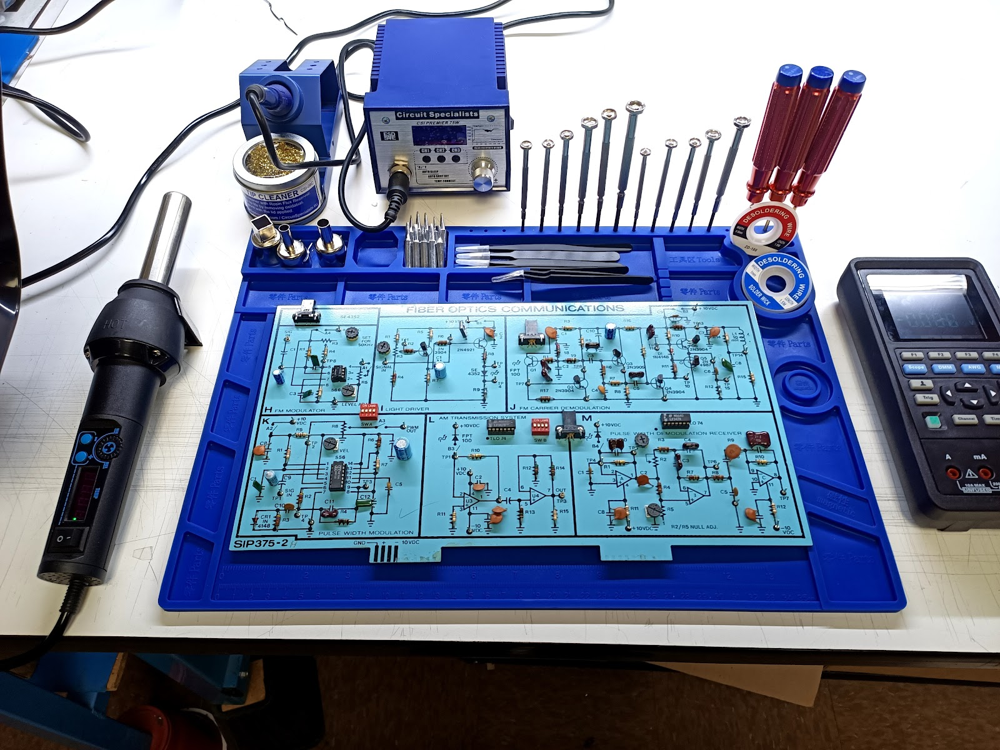

## Prepare Your Workspace

1. Ensure your workspace is clean, well-lit, and ventilated.
2. Arrange all tools and materials within easy reach.

---
[Previous: Intro](README.md) | [Next: Step 2](step2.md)
