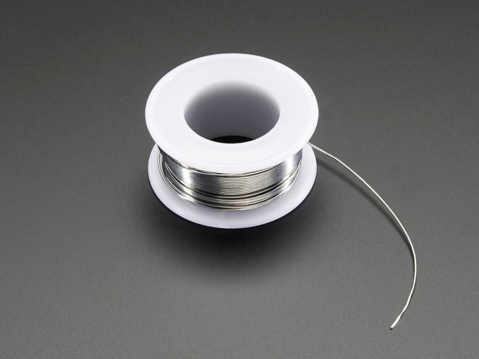

## Prepare the Components

1. Insert the components into the PCB. Bend the leads slightly to hold them in place.
2. Ensure the components are correctly oriented according to the circuit design.

---
[Previous: Step 2](step2.md) | [Next: Step 4](step4.md)

