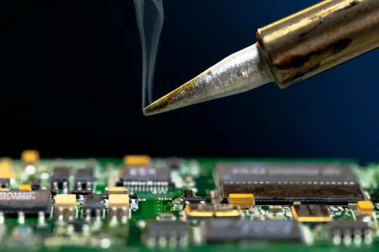

## Apply Heat to the Joint

1. Hold the soldering iron tip against the component lead and the PCB pad simultaneously.
2. Wait 1-2 seconds to heat the joint adequately.

---
[Prevoius: Step 3](step3.md) | [Next: Step 5](step5.md)
