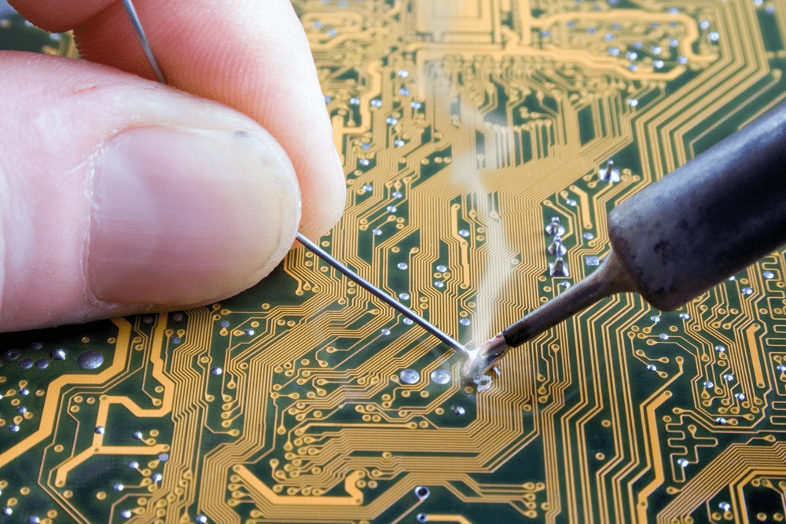

## Apply Solder

1. Touch the solder to the heated joint (not the soldering iron) and allow it to flow around the connection.
2. Remove the solder first, then the soldering iron.
3. Ensure the solder forms a shiny, cone-shaped joint.

---
[Previous: Step 4](step4.md) | [Next: Step 6](step6.md)
