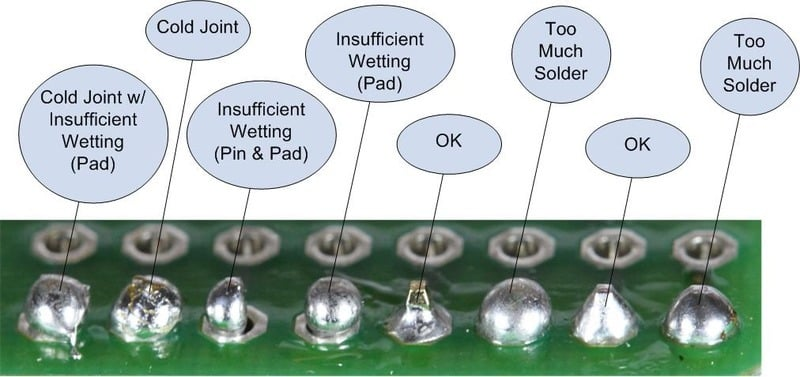

## Inspect the Joint

1. Check for cold joints (dull, irregular shapes) and re-solder if necessary.
2. Trim excess leads using wire cutters.

---
[Previous: Step 5](step5.md) | [Next: Tips](tips.md)
